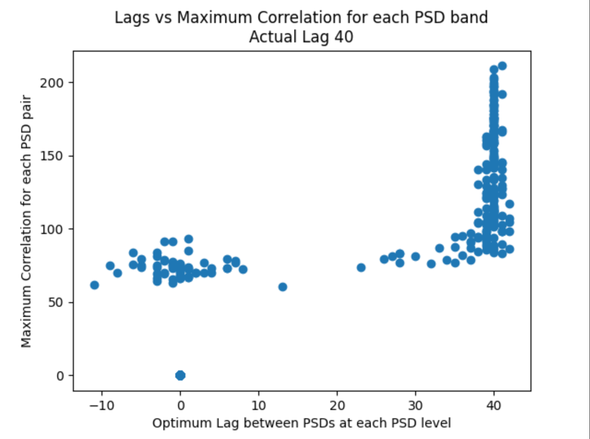

# Spectral Time Lag Similarity determination

## The goal of calculating Spectral Time Lag Similarity (STLS) is to create a metric to measure the similarity of biologic signals embedded in pairs of spectrograms.

Two calls are similar if their frequency components over the time of the call overlap.

By calculating the amount of shift that one PSD band needs to best match the same band in a different spectrogram, we get a measure of similarity for those two bands.

The lag between the two signals tells how much one band must be shifted and the correlation at that lag tells the degree of matching of the two PSD's

## Single PSD pair lag demonstration:
The first part of PSD_SimilarityDemo.py demonstrates the pair-wise PSD lag for a simple PSD vector and it's lagged twin.

## Spectrogram-like lag estimation:
This determination can be carried out for each PSD bands in a spectrogram and then the distribution of lags vs PSD band can be assessed to determine an overall measure of similarity.

Here is an example of the calculation of the psd lags and corresponding maximum of the correlation between the two PSD's  The actual lag was set to 40 and the scatter plot shows that the high correlation PSD pairs have calculated lags close to the input lag value of 40 used to create the spectrogram-like arrays.

